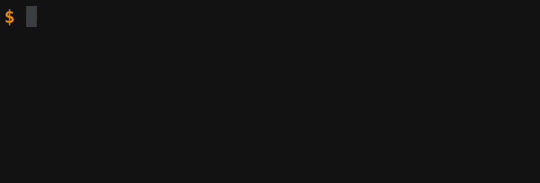

[](https://travis-ci.org/markelog/list) [](https://godoc.org/github.com/markelog/list) [](https://goreportcard.com/report/github.com/markelog/list)

# List

Terminal interactive list

```go
func GetAnimal() string {
  options := []string{"Gangsta panda", "Sexy turtle", "Killa gorilla",}

  l := list.New("Which animal is the coolest?", options)
  l.Show()

  // Waiting for the user input
  result := l.Get()

  return result // "Gangsta panda"
}

```


